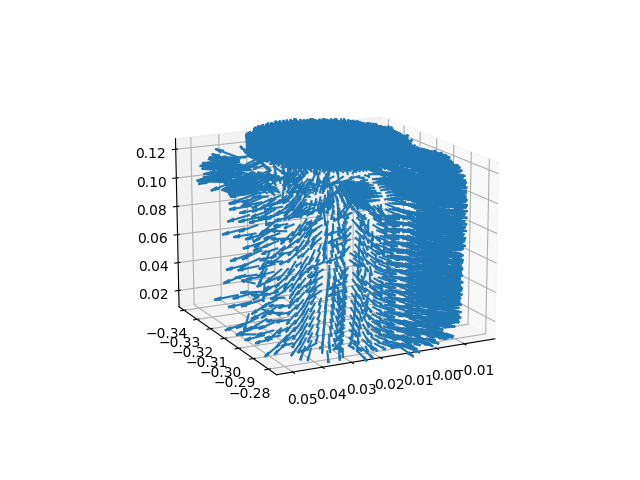
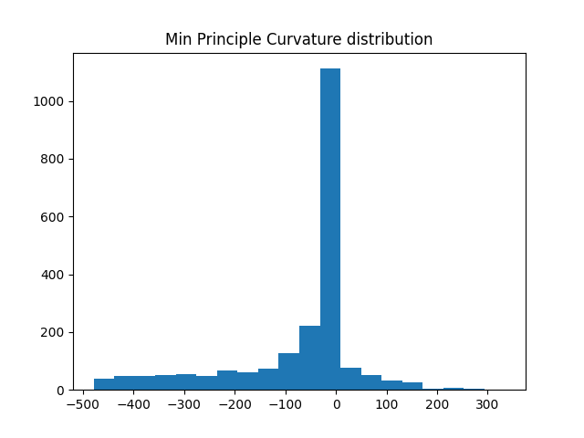
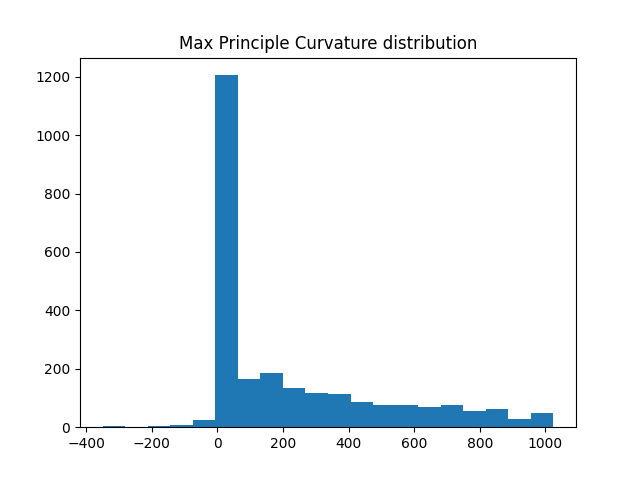

# Surface Normals and Curvature Estimation for Noisy Point Cloud Data

## About

A simple implementation for estimating Normals and Curvature of 3D Point Cloud Surfaces, based on:

    Estimating surface normals in noisy point cloud data 
    by Mitra, Niloy J. and An Nguyen - Symposium on Computational geometry (2003)

    Curvature estimation of 3D point cloud surfaces through the fitting of normal section curvatures 
    by Zhang, Xiaopeng, Hongjun Li, and Zhanglin Cheng - ASIAGRAPH (2008)

## What to look out for

The higher the resolution of the point cloud the better the estimates but if you have trouble with long runtimes try to lower the resolution by subsampling the point cloud. Try out a few resolutions until you find the sweetspot for your usecase. 

## Usage

Instantiate a PointCloudObject object with an (N, 3) numpy array, then calculate the surface normals and principle curvatures (Note that the normals are needed for the curvature calculation! ):

    object = PointCloudObject(point_cloud_data)
    object.compute_surface_normals()
    object.compute_principle_curvatures()

## Plots

There are two included methods for plotting. The first plots all the calculated Surface Normals using the matplotlib quiver plot:

    object.plot_surface_normals()

The second method plots a histgram of both min and max Principle Curvatures calculated at each point:

    object.plot_principle_curvature_disributions()

 | 